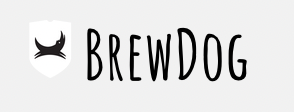
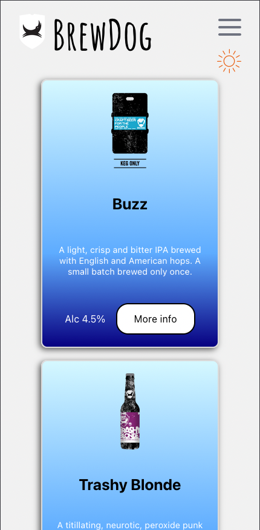
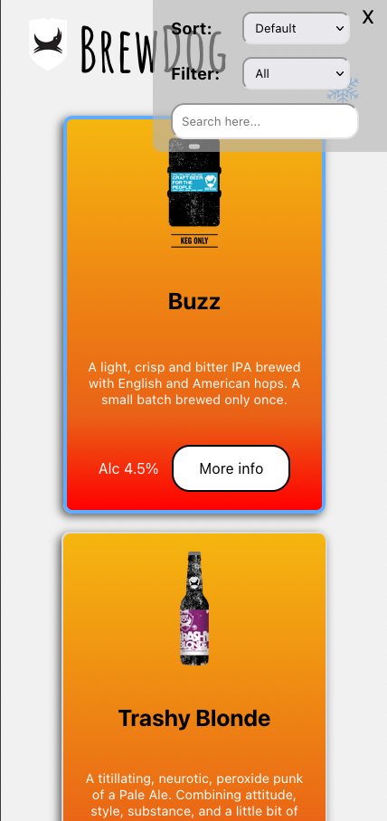
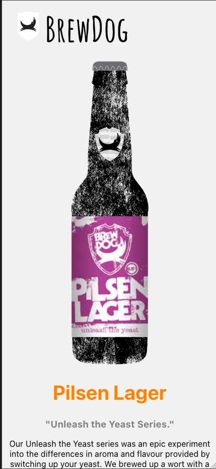
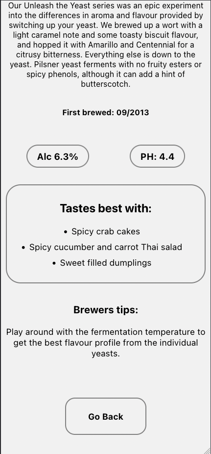
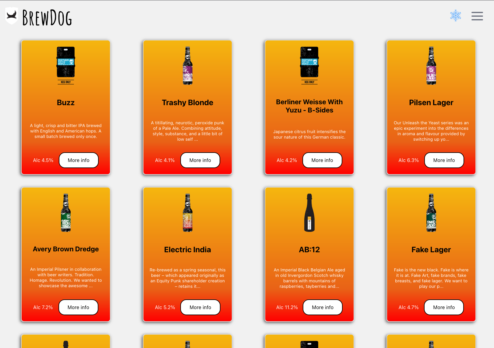
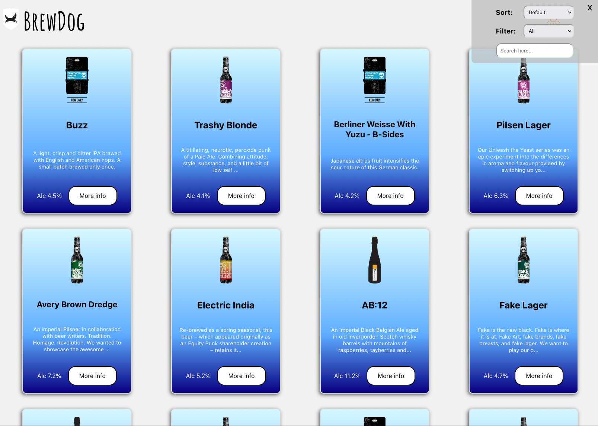
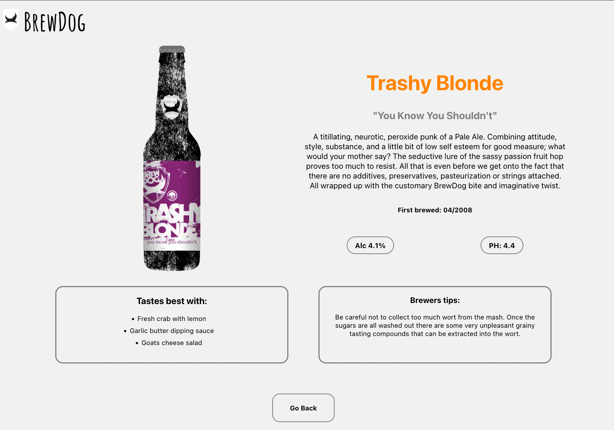

<p align="center">
  <a href="" rel="noopener">
 </a>
</p>

<h2 align="center">Punk API Website</h2>

---

<p align="center"> Just a simple website to list BrewDog beers.
    <br> 
</p>

## 📝 Table of Contents

- [About](#about)
- [Getting Started](#getting_started)
- [Running Tests](#tests)
- [Usage](#usage)
- [Screenshots](#screenshots)
- [Built Using](#built_using)
- [Authors](#authors)

## 🧐 About <a name = "about"></a>

Simple website to list BrewDog beers by using the [Punk API](https://punkapi.com). It has main page with all 325 beers listed, which you can search through, filter and sort at the same time. As well as change the theme from blue to orange. It also has a single page for each beer, that will show you more information about the beer. Everything is fully responsive. 
<br>  <br> 

## 🛠 Getting Started <a name = "getting_started"></a>

You can either go to [this site](https://dorbia.github.io/punk-api/#/) and it will work in your browser without having to do anything, or if you want to have it in your localhost, you can continue reading, to find out what to do.

To open the website in your localhost you need to download the repo, and then open terminal in the repo's folder. Run the following command: 
### `npm install`
to make it install every node modules you will need - npm will find it on it's own thanks to the dependencies. Once it's installed, you can run the command:
### `npm start`
and the app will be ready to see on the server.

Open [http://localhost:3000](http://localhost:3000) to view it in your browser.

<br> 

## 🔧 Running the tests <a name = "tests"></a>

To run tests, run the following command:
### `npm test`

### Break down into tests
I have tested things, what don't require API fetch, to check if they are in the document on the render.

I have also tested if the user clicks on the theme change button, the theme icon is supposed to change.

```
Example: clicking the sun icon should change it to the snowflake icon, and other way around.
```

As well as checking if the description will get shortened if it's above 120 characters.

```
Example: "A titillating, neurotic, peroxide punk of a Pale Ale. Combining attitude, style, substance, and a little bit of low self esteem for good measure; what would your mother say? The seductive lure of the sassy passion fruit hop proves too much to resist. All that is even before we get onto the fact that there are no additives, preservatives, pasteurization or strings attached. All wrapped up with the customary BrewDog bite and imaginative twist."

Will become: "A titillating, neurotic, peroxide punk of a Pale Ale. Combining attitude, style, substance, and a little bit of low self ..."
```
<br> 

## 🎈 Usage <a name="usage"></a>

- After going to [this site](https://dorbia.github.io/punk-api/#/) everything will render for you automatically.
- To change the theme, click on the sun/snowflake icon.
- To search, filter or sort beers, click on the hamburger menu icon in the top right corner and it will bring up the menu for you. The order of sorting/searching/filtering does not matter, it will work the same way each time. Use the dropdowns to sort/filter and textbox to search. To close the menu click on the "x" button or go to the single page and it will disappear.
- To go to the beer details page, click on the more info or type in the search bar https://dorbia.github.io/punk-api/#/beer/1 - you can change the 1 to a number you want from 1 to 325.
- To go back to the main page, click on the "Go Back" button, which is on the bottom of the page/the logo in the top-left corner or go to this link again: https://dorbia.github.io/punk-api/#/
- When being in the main page, to change the page, click on the number of the page you want to go to or the Next/Previous buttons - which are disabled when there is no previous/next page to go to.

<br> 

## 📸 Screenshots <a name = "screenshots"></a>
<div align="center">
  <h2>Mobile</h2>
    
    
    
    

  <h2>Desktop</h2>
    
    
    
</div>


## ⛏️ Built Using <a name = "built_using"></a>
React, JSX, CSS, SCSS, BEM

## ✍️ Author <a name = "authors"></a>
- [@DorBia](https://github.com/DorBia)

